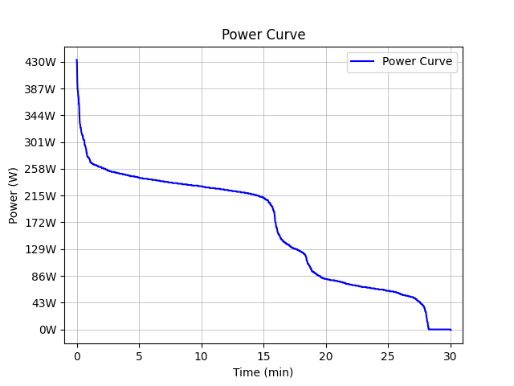

# Exercises for the course Programming 2
Group members:
1. Marius Valenta
2. Simon Schwarzer

## Exercise 1: Power Curve
In this task, data points from a bicycle computer representing wattage values are extracted from a .csv file. These data points are then sorted in descending order using a bubble sort algorithm. Subsequently, the sorted data points are plotted over time, and the resulting plot is saved.

## Saved Plot:

## Execution:
1. Clone this repository in VS Code
2. Open a new terminal in VS Code and run `pdm install`
3. Run power_curve.py to generate the plot